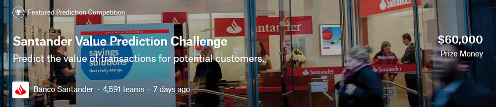
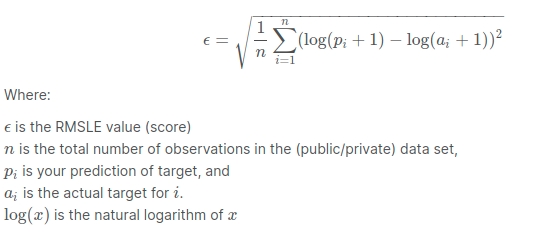

The evaluation metric for this competition is Root Mean Squared Logarithmic Error.

The RMSLE is calculated as

### [Link to Kaggle Competition](https://www.kaggle.com/c/santander-value-prediction-challenge/overview)

According to Epsilon research, 80% of customers are more likely to do business with you if you provide personalized service. Banking is no exception.

The digitalization of everyday lives means that customers expect services to be delivered in a personalized and timely manner… and often before they´ve even realized they need the service. In their 3rd Kaggle competition, Santander Group aims to go a step beyond recognizing that there is a need to provide a customer a financial service and intends to determine the amount or value of the customer's transaction. This means anticipating customer needs in a more concrete, but also simple and personal way. With so many choices for financial services, this need is greater now than ever before.

In this competition, Santander Group is asking Kagglers to help them identify the value of transactions for each potential customer. This is a first step that Santander needs to nail in order to personalize their services at scale.

## Setting Up

**_IMPORTANT: Due to Github's constraints on uploaded file sizes, I am unable to provide all the required data files that it'll take to smoothly run through all my scripts. If you would like to replicate my results, please follow the below instructions for setting up and making sure that all the required data files are present._**

###### Download the training and test sets for the Santander Kaggle challenge (https://www.kaggle.com/c/santander-value-prediction-challenge/data) and place these unzipped files in the **data** folder

Also, I would be remiss to not give a massive, heartfelt thanks to the collective Kaggle community whose generous sharing of wisdom has been a steady guide for exploring best-practices to solve these problems.
